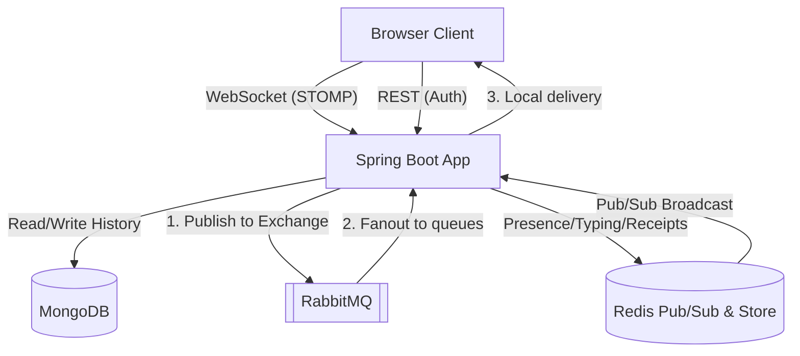

# PulseChat

PulseChat is a real-time messaging application that demonstrates a robust, scalable architecture for WebSocket-based communication.

## Architecture

PulseChat's architecture is designed for horizontal scalability, durability, and secure identity management.



### Two-Hop Delivery Path (RabbitMQ + Redis)
The messaging delivery path uses a **two-hop** design:
1. **RabbitMQ for Messages**: When a client sends a message to `/app/chat/{roomId}`, the application saves it to MongoDB and then publishes it to a RabbitMQ fanout exchange (`chat.exchange`). Each app instance binds its own transient queue to this exchange. This guarantees that messages are reliably delivered (at-least-once) to all connected instances, which then route the message to local WebSocket sessions subscribed to `/topic/room.{roomId}`.
2. **Redis for Ephemeral Events**: For high-frequency, non-durable events like presence (online status), typing indicators, and read receipts, the system uses Redis. Redis pub/sub handles fast broadcasting to all nodes, and Redis key-value storage (with TTLs) manages presence state without burdening the persistent database or RabbitMQ.

### Identity-Security Pattern
A core security property of this system is that **all sender, typing, and read-receipt identities are derived from the authenticated session, never from the client payload**. 
- During the STOMP connection handshake, the JWT token is validated, and the `userId` and `username` are securely attached to the WebSocket session attributes.
- Whenever the client sends a message or triggers an event, the backend overrides or injects the identity fields using these trusted session attributes. This makes identity spoofing impossible at the WebSocket protocol level.

## Features

### Implemented
- **Authentication**: JWT-based registration and login.
- **Real-time Messaging**: Multi-room chat using STOMP over WebSockets.
- **Durability**: MongoDB for chat history and user accounts.
- **Scalability**: Ready for multiple instances (tested with two nodes locally) using RabbitMQ for message routing and Redis for ephemeral events.
- **Presence**: Real-time "Online Now" sidebar, backed by Redis keys with 30s TTL and heartbeat.
- **Read Receipts**: Optimistic UI updates with double-check (`✓✓`) marks for read confirmation.
- **Typing Indicators**: Throttled (2s) typing events broadcasted over Redis.
- **Input Validation**: Hardened endpoints rejecting invalid or blank inputs (`@Valid`, `@RestControllerAdvice`).

### Pending / Not Implemented
- TLS / HTTPS
- Rate limiting
- Advanced load testing
- File attachments

## Deployment

**Decision: Local-only Demo**
For the purposes of this project, PulseChat is kept as a local-only deployment. Deploying a full stack (MongoDB, RabbitMQ, Redis, Spring Boot, React) alongside our existing DocAI services on a single AWS `t3.micro` instance would likely exceed the 1GB RAM limit. To maintain stability, we run this locally via Docker Compose.

## Setup Instructions

### Prerequisites
- Docker & Docker Compose
- Node.js (for the frontend)

### Backend
1. Navigate to `pulsechat-backend`.
2. Ensure you have a `.env` file with `JWT_SECRET` (at least 32 bytes) and default host configurations for Mongo, Rabbit, and Redis.
3. Start the infrastructure and backend app:
   ```bash
   docker-compose up -d --build
   ```
4. The API will be available at `http://localhost:8081`.

### Frontend
1. Navigate to `pulsechat-ui`.
2. Install dependencies:
   ```bash
   npm install
   ```
3. Start the Vite development server:
   ```bash
   npm run dev
   ```
4. Access the application at `http://localhost:5173`.
